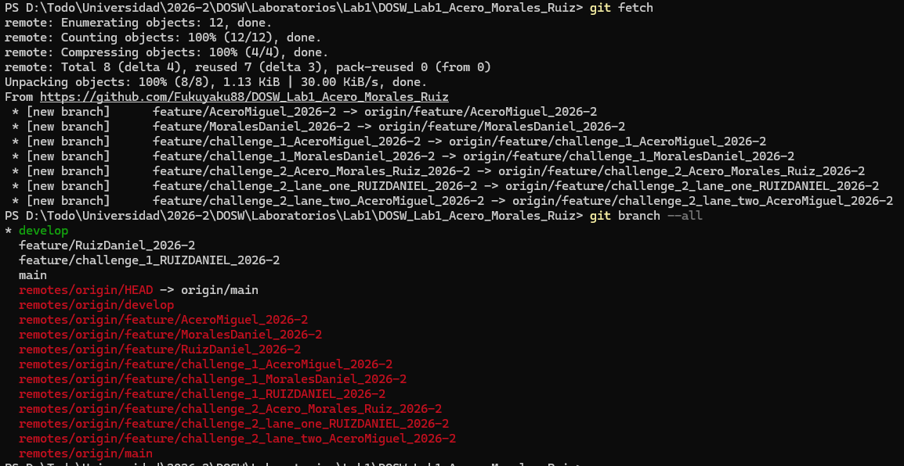
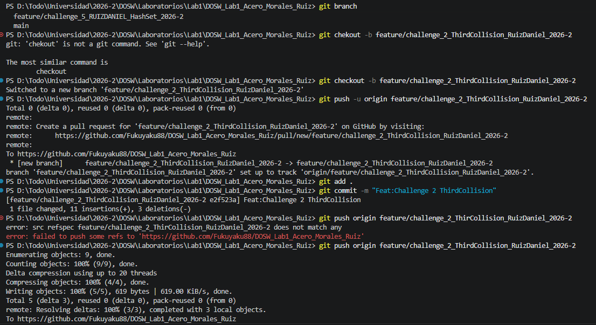
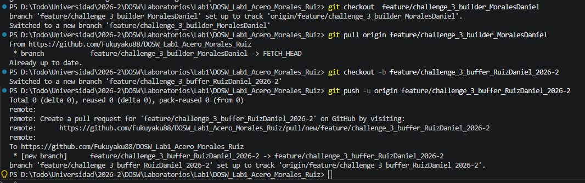
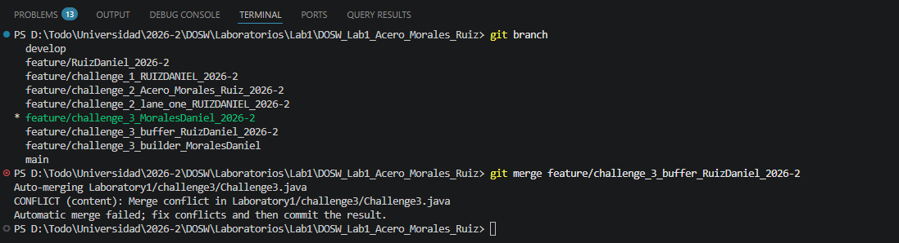
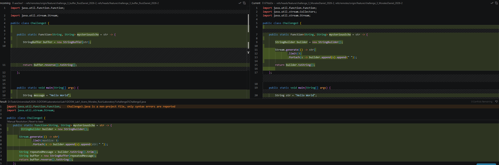

# Laboratory 1 — Git, GitHub, and Functional Programming
**Course:** DOSW (2026-2)  
**Team Members:** Daniel Santiago Morales Perdomo, Miguel Ángel Acero Laverde, Edgar Daniel Ruiz Patiño

## Challenge 1 — Welcome Message

### Evidence

### Description

Briefly explain:

- What was implemented.
- How the work was divided.
- Which Git operations were used.
- Which conflicts appeared.
- How the conflicts were resolved.

## Challenge 2 — Parallel Commit Raise

### Evidence
This challenge simulates parallel development, synchronization, and merge conflicts.
Ruiz Daniel evidence:
- Fetch use

- Third collision

### Description

Briefly explain:

- What was implemented.
- How the work was divided.
- Which Git operations were used.
- Which conflicts appeared.
- How the conflicts were resolved.

## Challenge 3 — Mysterious Echo

### Evidence
Ruiz Daniel evidence:
- StringBuffer update

- merge

- Conflicts

### Description

Briefly explain:

- What was implemented.
Ruiz Daniel: I implemented the code to create the Stringbuffer, also I made Collisions and resolved the conflicts

- How the work was divided. $\newline$
Ruiz Daniel: I was student B 
- Which Git operations were used.$\newline$
Ruiz Daniel: git checkout/git merge/git commit / git push/git pull/git fetch/git branch

- Which conflicts appeared.$\newline$
Both function have the same name
- How the conflicts were resolved. $\newline$
we have a conflict with a repeated function name, the solution was join the two functions into one
## Challenge 4 — The Treasure of Duplicate Keys

### Evidence

### Description

Briefly explain:

- What was implemented.
- How the work was divided.
- Which Git operations were used.
- Which conflicts appeared.
- How the conflicts were resolved.

## Challenge 5 — Battle of Sets

### Evidence

### Description

Briefly explain:

- What was implemented.
- How the work was divided.
- Which Git operations were used.
- Which conflicts appeared.
- How the conflicts were resolved.

# Challenge 6— The Decision Machine

### Evidence

### Description

Briefly explain:

- What was implemented.
- How the work was divided.
- Which Git operations were used.
- Which conflicts appeared.
- How the conflicts were resolved.