# Laboratory 1 — Git, GitHub, and Functional Programming
**Course:** DOSW (2026-2)  
**Team Members:** Daniel Santiago Morales Perdomo, Miguel Ángel Acero Laverde, Edgar Daniel Ruiz Patiño

## Initial Config

Miguel Angel Acero Laverde

Daniel Santiago Morales Perdomo

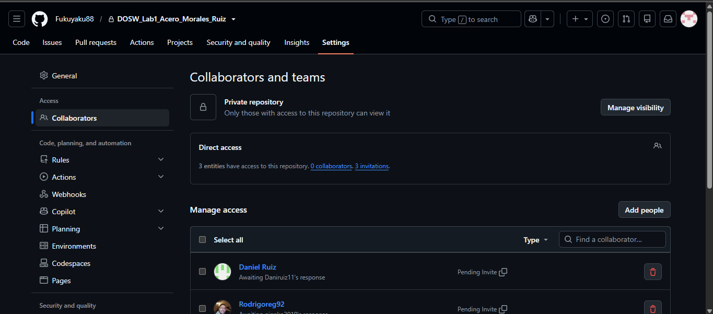
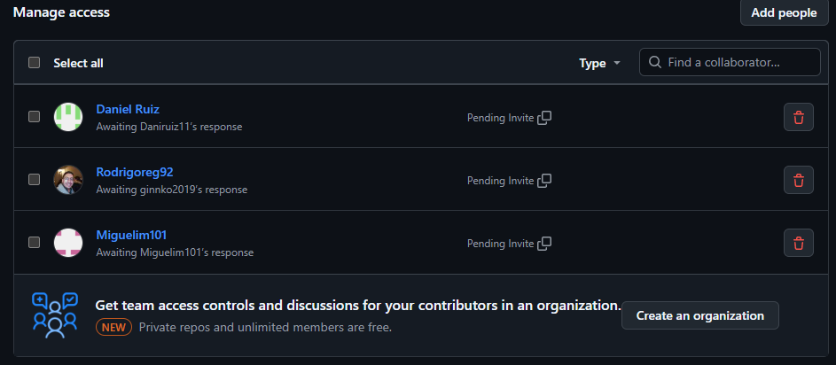
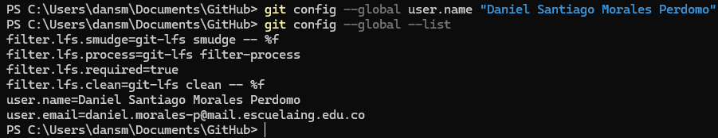

Edgar Daniel Ruiz Patiño

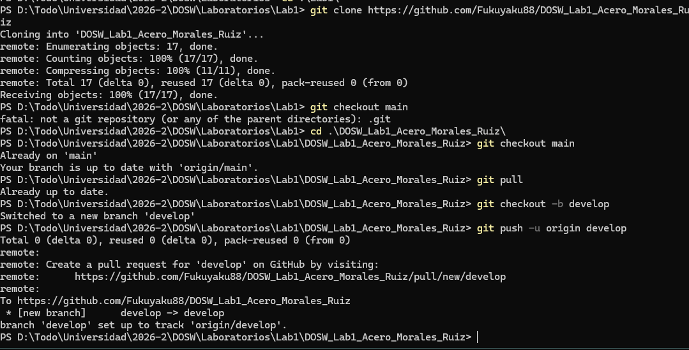
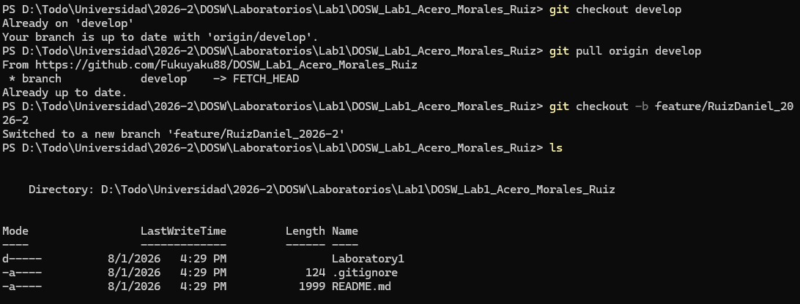

## Challenge 1 — Welcome Message

### Evidence
Ruiz Daniel evidence:

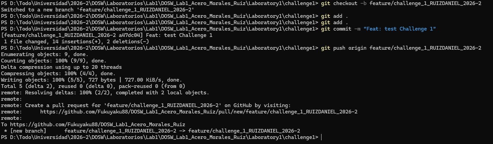

Morales Daniel evidence:

Miguel Acero evidence:
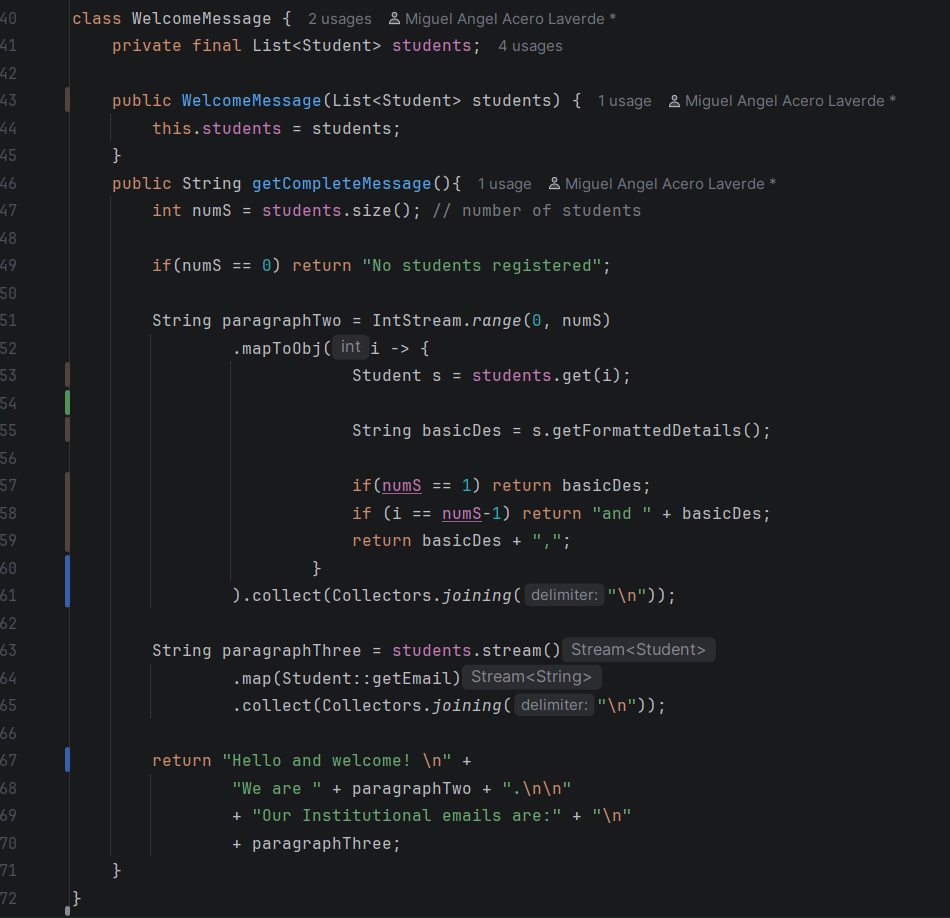
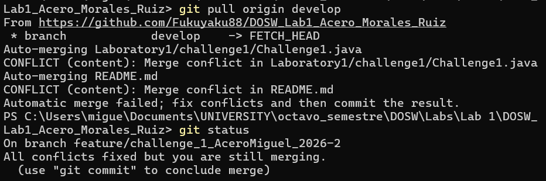
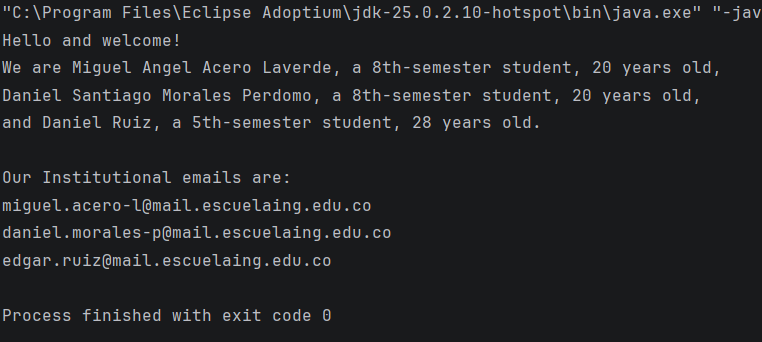

### Description
We had to create a structure message showing basic information
of each member of the group. Things like: name, currently
semester and institutional email.
On the other hand, was necesary create our own
locally branch to work, for then upload in GitHub and
merge with develop.
Create a welcome message using Java functional programming.

Briefly explain:

- What was implemented. $\newline$ Ruiz: I created the test class, named it, and committed it.
Morales: I added the class Student with it´s attributes and getters.
- How the work was divided. $\newline$ There are 3 classes, one for each of one of the team members, Ruiz with the Challenge1 class, Morales with the Student class, and Acero with the class WelcomeMessage class.
- Which Git operations were used. $\newline$ Ruiz: I used the add . and commit command, also i used the push command, Morales: I used checkout, add ., commit, push, pull origin and merge.
- What was implemented. 
1. Ruiz: I created the test class, named it, and committed it.
2. Morales: I added the class Student with it´s attributes and getters.
3. Miguel: I created the WelcomeMessage class with it's readme evidence and resolve the conflicts
- How the work was divided. 
$\newline$ There are 3 classes, one for each of one of the team members, Ruiz with the Challenge1 class, Morales with the Student class, and Acero with the class WelcomeMessage class.
- Which Git operations were used. 
1. Ruiz: I used the add . and commit command, also i used the push command. 
2. Morales: I used checkout, add ., commit, push, pull origin and merge.
3. Miguel: I used the same commands of my partners.
- Which conflicts appeared.
1. Miguel: Appeared conflict like CONFLICT (content) because one class
was created into principal class changing content of the class into my branch-.
- How the conflicts were resolved.
1. Miguel: I needed to move manually the class into the principle class and 
cut it to copy outside of principle class. Finally code worked and upload to 
develop branch.

## Challenge 2 — Parallel Commit Raise

### Evidence
### Evidence
This challenge simulates parallel development, synchronization, and merge conflicts. $\newline$
Ruiz Daniel evidence:
- Fetch use

- Third collision

Miguel Acero evidence:
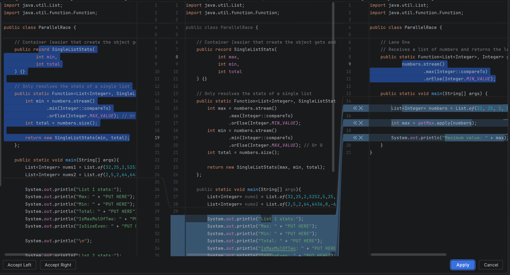
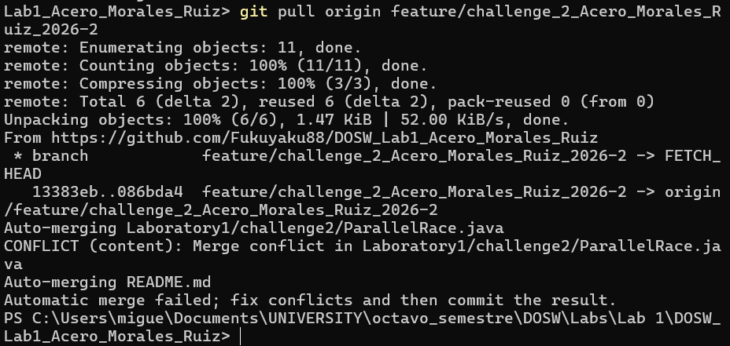
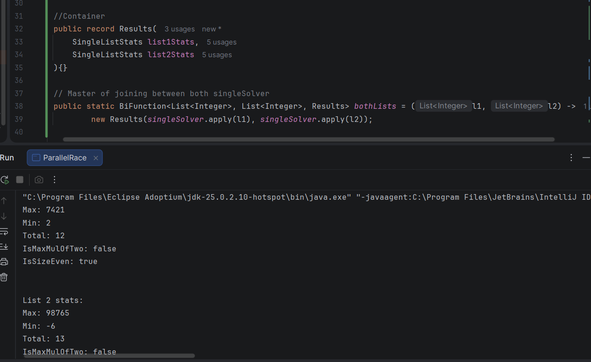
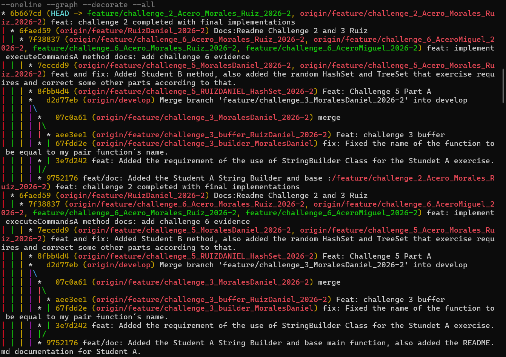

### Description

Briefly explain:

- What was implemented.
  - Morales create the challenge main challenge branch, changed the name to the file, and added tha base class and elements to use.
  - Miguel: I implemented the Lane Two when lamda-based function, returns the smallest and total size.
  - Morales: Added the second lap to the challenge 2, and correct the output to show the final answer just for one list.
  - Miguel: I created a single function that receives two list of numbers adn returns a 
    Results object containing. For this reason, my last work here was review and integrate the final solution
    with Results container and bothLists BiFunction.
- How the work was divided.
  - Acero: Lane Two, fix first collision.
  - Morales: Created the base and tests class, Added all the second lap and also the correct output.
  - Ruiz: Lane One, Third lab
- Which Git operations were used.
  - Morales use checkout, pull origin, checkout -b, push -u origin, add ., commit, push origin.
  - Miguel: ckeckout, add ., pull origin, push, merge (with general challenge two branch), fetch 
    (to upodate all cloude branches).
  - Miguel: To merge with develop branch I used: ckeckout, pull origin, merge, add ., commit.
- Which conflicts appeared.
  - Miguel: CONFLICT (content): Merge conflict in Laboratory1/challenge2/ParallelRace.java when content
    between laneOne and laneTwo crash in the same function (same name, different content)
- How the conflicts were resolved.
  - Miguel: Only just necessary merge manually changes into the same function.

## Challenge 3 — Mysterious Echo

### Evidence
Ruiz Daniel evidence:
- StringBuffer update

- merge

- Conflicts

### Description

Briefly explain:

- What was implemented. $\newline$
Ruiz Daniel: I implemented the code to create the Stringbuffer, also I made Collisions and resolved the conflicts $\newline$
Morales: As student A, I implement Function, Collectors, Stream, Function to create a functional interface for the function that I pass to solve the builder case, Collectors to convert the final stream into a String again with the joining with spaces, and Stream to pass the String to a Stream and operate over each element or in this case to repeat again all tha String 3 times, taking all the String as an element.
- How the work was divided. $\newline$
Morales take the Student A role.$\newline$
Ruiz Daniel: I was student B and I made merge conflicts.
- Which Git operations were used.$\newline$
git checkout/git merge/git commit / git push/git pull/git fetch/git branch /git add .

- Which conflicts appeared.$\newline$
Both function have the same name
- How the conflicts were resolved. $\newline$
we have a conflict with a repeated function name, the solution was join the two functions into one

## Challenge 4 — The Treasure of Duplicate Keys

### Evidence
Ruiz Daniel evidence: $\newline$
- HashTable
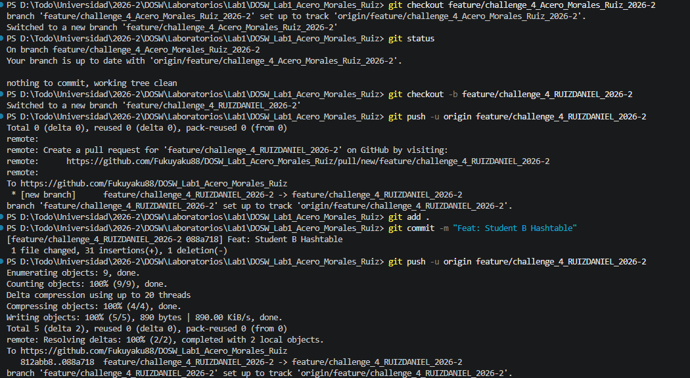

### Description

Briefly explain:

- What was implemented.
  - Miguel: I implemented a method (like Student A) that receives key-value
      pairs of type (String, Integer), stores them in a HashMap, ignores duplicate 
      keys and preserves the first value found.
  - Daniel Ruiz: I created the HashMap and added the elements to it-
  - Morales: I implement the merge goal, so in my case I doesn´t implement nothing new, but fix the main function to be according to the output requirements, and also added the merge answer.
- How the work was divided.
  - Miguel was the Student A proving hashMap characteristics
  - Daniel Ruiz was the Student B, creating the HashMap
  - Morales: Implement the merge goal.
- Which Git operations were used.
  - Miguel: I used typical commands to give changes from cloud like pull origin, 
    ckeckout -b to create my personal challenge 4 branch, git push origin.
  - Morales: I used checkout, pull origin, add ., commit, push and merge.
- Which conflicts appeared.
  - Morales: 
- How the conflicts were resolved.
  - Morales: 

## Challenge 5 — Battle of Sets

### Evidence

Miguel Angel Acero Laverde
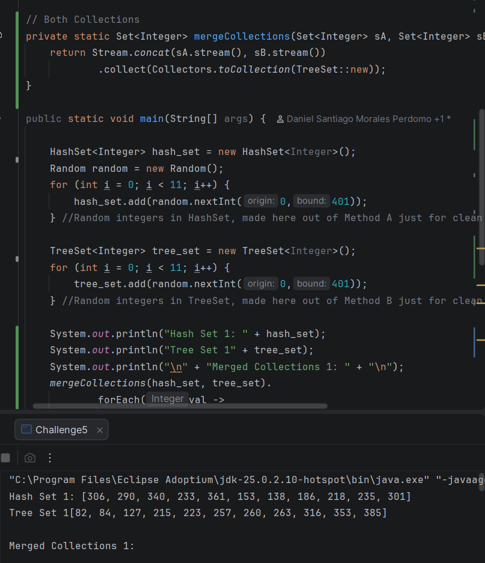

Edgar Daniel Ruiz Patiño
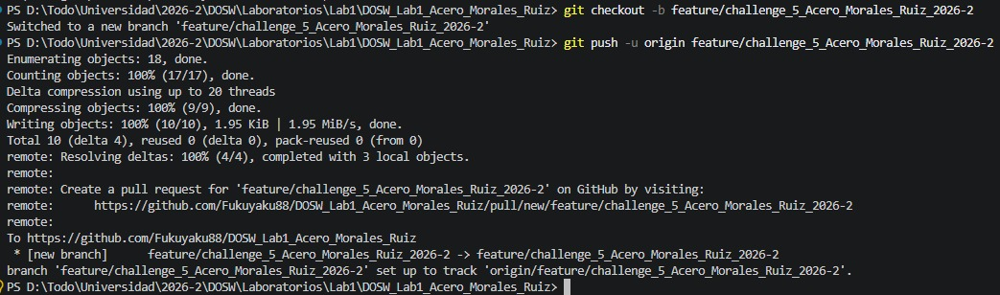

### Description

Briefly explain:

- What was implemented. 
  - Morales: As Student B added the method for TreeSet army, so I only use TreeSet, 
    Stream and Collectors library, to transform the original TreeSet into a Stream, 
    then filter the data by numbers not divisible by 5, and finally join it again 
    with Collectors into another TreeSet, also added the random HashSet and TreeSet 
    that the exercise requires, so I use the library Random for that.
  - Miguel: I created the mergeCollections method which merge both different output 
    collections given by other methods (two). And fix the test to prove different cases.
- How the work was divided. 
  - Ruiz: Created general branch and worked as Student A (HashMap method)
  - Morales: As Student B added the method for TreeSet army, and added the random 
    HashSet and TreeSet that the exercise requires, so I use the library Random 
    for that.
  - Miguel: Fished the challenge implementing merge method to join both solutions
    and responsible to merge with develop branch.
- Which Git operations were used. 
  - Morales: I used checkout, pull origin, add ., commit, push and merge.
  - Miguel: I used checkout, pull origin, add ., commit, push, merge, branch and status.
- Which conflicts appeared.
  - Conflicts related with challenge 5 lines (but respect of add new information)
- How the conflicts were resolved.
  - Only just to choose the changes tha we have to save and deny them not. And all of this 
    to manual way.

# Challenge 6— The Decision Machine

### Evidence

Miguel Angel Acero Laverde
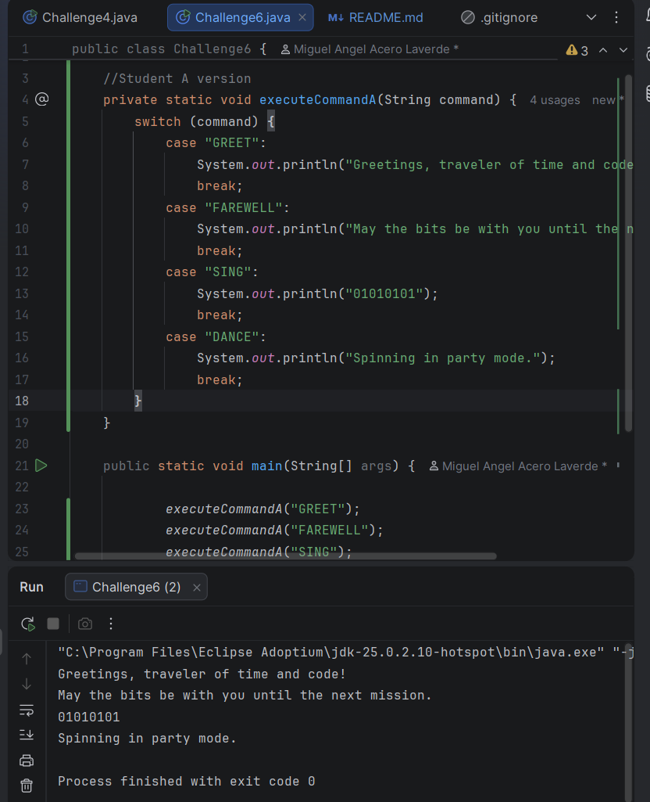

Daniel Santiago Morales Perdomo
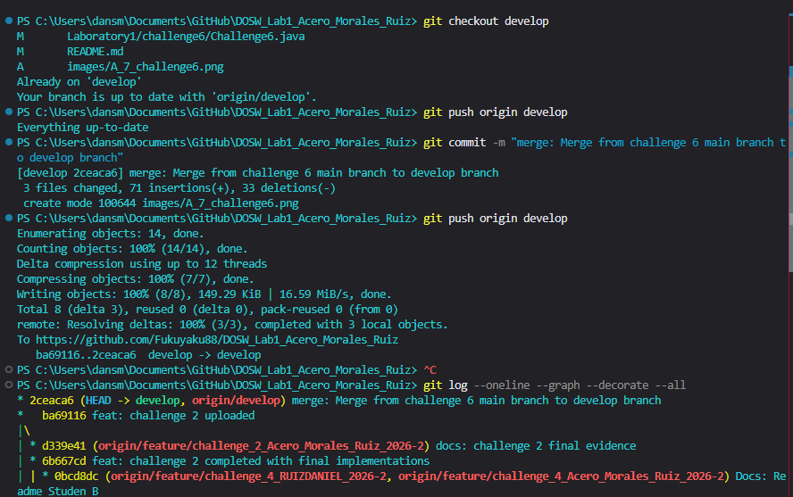
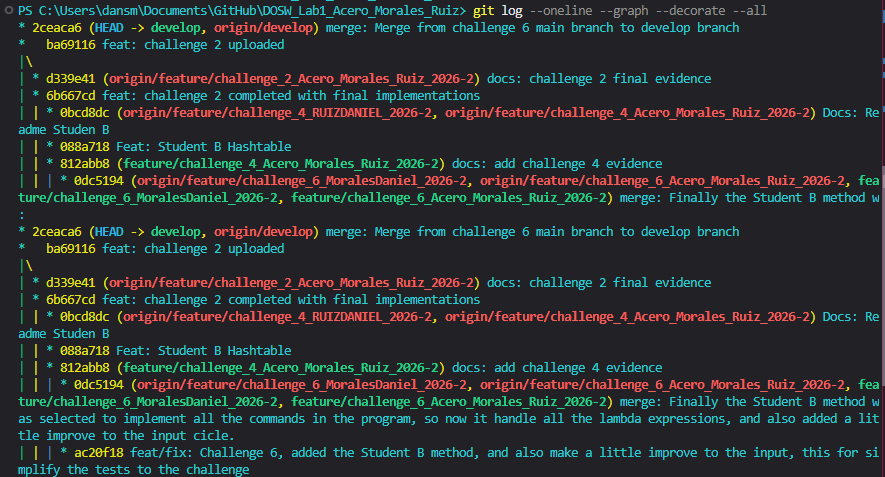
### Description

Briefly explain:

- What was implemented.
  - Miguel: I implemented the executeCommandsA method of challenge 6.
    In my case, we needed to create commands using switch statement.
  - Morales: I implemented the executeCommandsB method of challenge 6, for that reason I use the lambda expressions inside a Map<String, Runnable>, to execute it according to the Key or in this case command.
  - Morales: I complete the merge goal, so finally I doesn´t have to implement something new.
- How the work was divided.
  - Miguel created the Student A commands using switch statement and
    printed the first fourth commands (simple way, invoking method).
  - Morales: I implemented the executeCommandsB method of challenge 6, and also make a little improve to take input commands, and answer according to it, this to test the challenge several times.
  - Morales: I complete the merge goal, so I decide that the Student B method was the more appropiate to make an based command program, because for switch we have to put more lines just to put a base command, otherwise with Map and lambda expressions, we just need to add a new value and key to the map.
- Which Git operations were used.
  - Miguel: I used some like ckeckout -b ..., pull origin, add ., push,
    branch, status.
  - Morales: ckeckout, pull origin, add ., commit, push, merge.
- Which conflicts appeared.
 Morales: There was a conflict in README.md, because Miguel deleted a part where someone added the questionnaire answers, and the PararellRace.java (challenge 2 file) because my the main challenge 6 branch, has the challenge 2 file empty, and in develop it was complete.
- How the conflicts were resolved.

Morales: For README.md I just accept the change to erase the answer of the questionnaire, and for the challenge 2 file, I just accept the change of add all the complete challenge.
